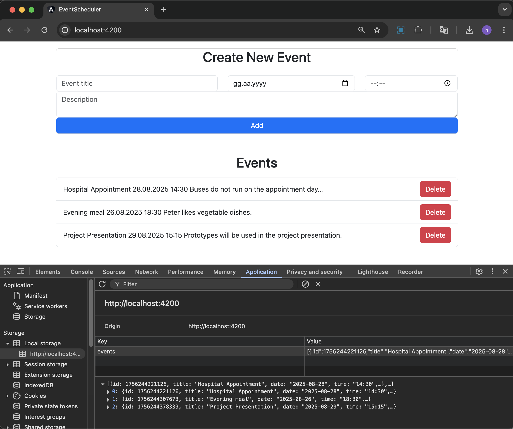

# Event Scheduler (Angular 16)

A lightweight **Event Scheduler** application built with Angular 16.  
Users can add, list, and delete events (title, date, time, description).  
All data is stored in the browser’s **localStorage**.

## Tech Highlights
- Angular components & data binding
- Template-driven forms (`[(ngModel)]`)
- Event handling & `*ngFor` listing
- Angular Date Pipe for formatting
- LocalStorage persistence

## Run Locally
```bash
npm install
ng serve
```


## UI Preview

